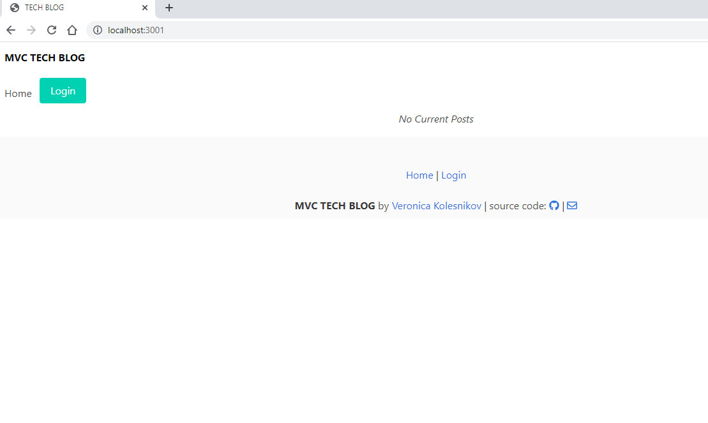
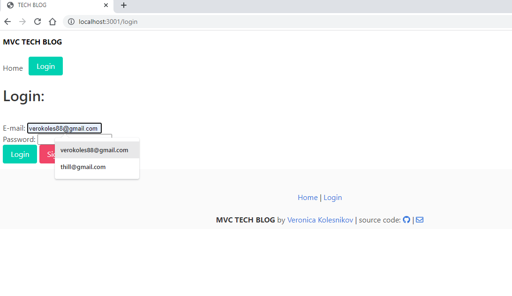

# TECH-BLOG:woman_office_worker:

  [](https://opensource.org/licenses/Apache-2.0)
## Purpose:exclamation:
To build a CMS-style blog site similar to a Wordpress site, <br>
where developers can publish their blog posts <br>
and comment on other developers’ posts as well.


### USER STORY: <br>
"AS A developer who writes about tech <br>
I WANT a CMS-style blog site <br>
SO THAT I can publish articles, blog posts, and my thoughts and opinions"




   ## Table of Contents::mag:
   1. [ Installation ](#installation)
   2. [ Usage ](#usage)
   3. [ License ](#license)
   4. [ Contributing ](#contributing)
   5. [ Heroku ](#heroku)

   ## Installation:

   To install dependancies, run the following commands:

     ```
    npm install:
    express
    node
    heroku
    sequelize
    mysql2
    express-handlebars
    init
    dotenv
    bcrypt
    express-session
    connect-session-sequelize
      ```

## Usage:

    For usage, please make sure to add comments and submit merge requests to Github.com.


## License: 

     Apache-2.0 

   [Link to Apache-2.0 license](https://opensource.org/licenses/Apache-2.0)


  

## Contributing:
    Please be kind and professional when adding to or accessing this repository. Thank you!
  [More on Contribution Guidelines](https://github.com/verokoles/readme-generator/blob/f57cf6a98bf276960885496059df4b039247c985/contributing.md)


## Heroku:heavy_plus_sign:
   
   See my repo deployed to [Heroku.com](https://git.heroku.com/tech-blog-veronica.git)